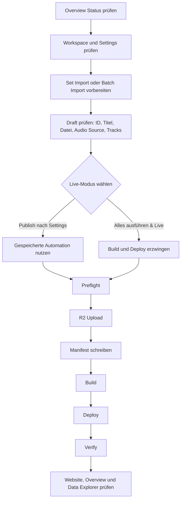
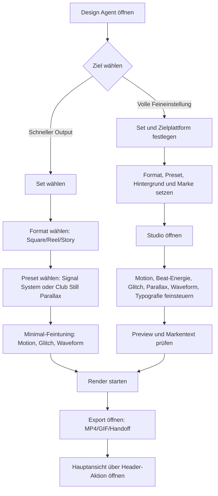
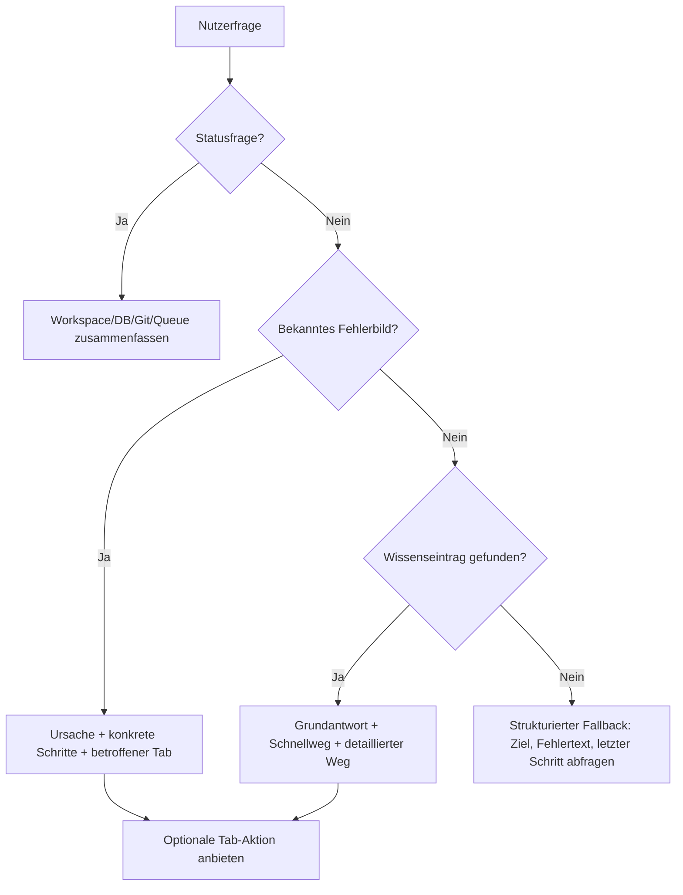
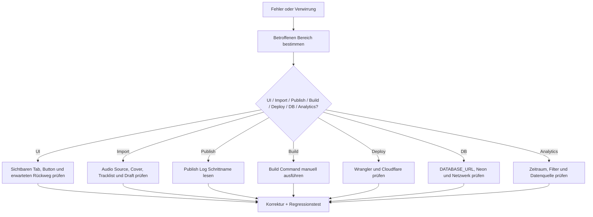

# Flight Deck Workflow Diagramme

Diese Seite beschreibt die wichtigsten AIRDOX Flight-Deck-Abläufe als Mermaid-Diagramme und als sprachliche Interpretation. Sie ergänzt [[flightdeck-expert-handbook]], [[flightdeck-troubleshooting]] und [[local-02-online-publish-runbook]].

Ziel: Der Assistant soll Diagramme nicht nur wiedergeben, sondern in konkrete Schritte übersetzen. Jede Antwort zu einem Workflow braucht mindestens:

1. einen Schnellweg,
2. einen detaillierten Weg mit Feineinstellungen,
3. eine Aussage, woran der Nutzer den Erfolg erkennt,
4. einen Diagnosepfad, falls der Ablauf stoppt.

## Go-Live Pipeline

Interpretation in Worten:

1. Der Nutzer startet nicht im Publish-Button, sondern in der Zustandsprüfung.
2. Workspace, Settings und Draft sind Eingangsvoraussetzungen.
3. `Publish nach Settings` respektiert gespeicherte Automationen; `Alles ausführen & Live` erzwingt die vollständige Live-Kette.
4. Der Erfolg ist erst nach `Verify` erreicht, nicht nach dem ersten erfolgreichen Log-Eintrag.
5. Nachkontrolle heißt: Website öffnen, Overview refreshen, `track_stats` im Data Explorer prüfen.

Wenn dieser Ablauf stoppt, ist der fehlerhafte Knoten entscheidend:

- `Preflight`: Workspace, Settings oder Draft korrigieren.
- `R2 Upload`: `.env`, R2 Credentials, Bucket, Prefix und Audio Source prüfen.
- `Manifest`: Set-ID, Datei, Schreibrechte und Manifest-Konflikte prüfen.
- `Build`: `npm run build` manuell ausführen und die erste konkrete Fehlermeldung beheben.
- `Deploy`: Wrangler/Cloudflare/Auth prüfen.
- `Verify`: Live-Bundle, Cache, Set-ID und Track-Tokens prüfen.

## Design Agent / Design Studio

Interpretation in Worten:

1. Der schnelle Weg ist für ein brauchbares Visual mit wenigen Entscheidungen.
2. Der detaillierte Weg ist für bewusste Creative Direction und Feineinstellungen.
3. Der Nutzer soll nicht alle Presets und Regler wahllos ausprobieren. Erst Ziel, Set und Format klären, dann Regler anfassen.
4. Die wichtigsten Schnell-Regler sind Motion, Glitch und Waveform.
5. Die vollständige Feineinstellung umfasst zusätzlich Beat-Energie, Parallax, Typografie, Marke und Hintergrund.
6. Das separate Design Studio muss immer einen Rückweg zur Hauptansicht anbieten.

## Assistant Antwortlogik

Interpretation in Worten:

1. Der Assistant darf keine reine Feature-Liste als Hilfe ausgeben.
2. Jede bekannte Frage braucht eine direkt ausführbare Reihenfolge.
3. Jede Workflow-Antwort braucht Schnellweg und detaillierten Weg.
4. Fehlerantworten müssen den technischen Fehler in Alltagssprache übersetzen.
5. Wenn die Frage nicht erkannt wird, muss der Assistant gezielt nach Ziel, Fehlertext und letztem Schritt fragen.

## Fehlerdiagnose

Interpretation in Worten:

1. Erst den Bereich bestimmen, dann handeln.
2. Nicht mehrere Dinge gleichzeitig ändern, sonst ist die Ursache nicht mehr nachvollziehbar.
3. UI-Probleme brauchen einen sichtbaren Rückweg und einen Test für genau diese Route.
4. Publish-Probleme werden über den Log-Schritt diagnostiziert.
5. Jede Korrektur braucht mindestens einen passenden Test oder eine nachvollziehbare manuelle Prüfung.

## Assistant-Pflicht für Diagramme

Wenn der Assistant auf einen Diagramm-Workflow verweist, muss er ihn so erklären:

1. "Du bist gerade an diesem Punkt im Ablauf ..."
2. "Der nächste sinnvolle Schritt ist ..."
3. "Wenn du schnell fertig werden willst ..."
4. "Wenn du alle Feineinstellungen selbst machen willst ..."
5. "Erfolgreich ist es erst, wenn ..."
6. "Wenn es stoppt, prüfe genau diesen Knoten ..."

Diese Regeln sind Teil der Wissensabdeckung für [[flightdeck-expert-handbook]], [[flightdeck-faq]] und [[flightdeck-troubleshooting]].
