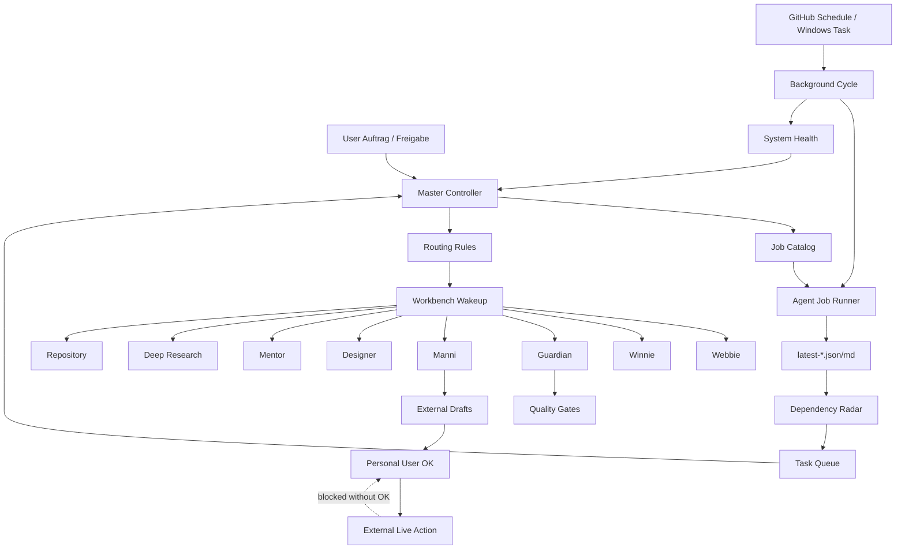

# AIRDOX Agenten-Systemstatus

Erstellt: 2026-06-05T19:57:24.325Z

## Ueberblick

- Status: OK
- Jobs: 44 (22 script, 22 manual)
- Externe Live-Jobs mit Gate: 5
- Veraltete Berichte: 0
- Hinweise: 1

## Architektur

## Automatisierung

- npm background script: present
- health script: present
- Windows task installer: present
- .github/workflows/agent-background-monitor.yml: present
- .github/workflows/agent-job-dispatch.yml: present

## Berichte

| Bericht | Status | Alter h | Pfad |
| --- | --- | ---: | --- |
| background-cycle | fresh | 6.2 | docs/agent-system/latest-background-cycle.json |
| job-run | fresh | 0.19 | docs/agent-system/latest-job-run.json |
| audit | fresh | 0.19 | docs/agent-system/latest-audit.json |
| dependency-radar | fresh | 0 | docs/agent-system/latest-agent-dependency-radar.json |
| task-queue | aging | 303.08 | docs/agent-system/latest-agent-task-queue.json |

## Hinweise

- watch: task-queue is aging (303.08h old). Naechster Schritt: Let the next scheduled background cycle refresh it.

