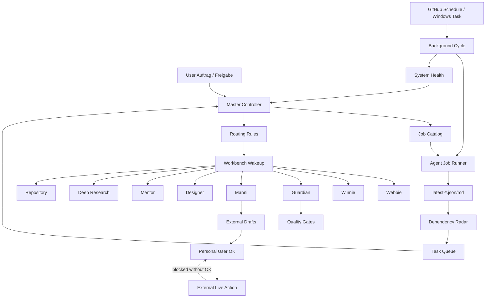

# AIRDOX Agent System Health

Generated: 2026-05-31T16:30:32.983Z

## Summary

- Status: ACTION_REQUIRED
- Jobs: 42 (22 script, 20 manual)
- External live jobs gated: 5
- Stale reports: 1
- Alerts: 2

## Architecture

## Automation

- npm background script: present
- health script: present
- Windows task installer: present
- .github/workflows/agent-background-monitor.yml: present
- .github/workflows/agent-job-dispatch.yml: present

## Reports

| Report | Status | Age h | Path |
| --- | --- | ---: | --- |
| background-cycle | stale | 68.75 | docs/agent-system/latest-background-cycle.json |
| job-run | fresh | 0.02 | docs/agent-system/latest-job-run.json |
| audit | fresh | 0.02 | docs/agent-system/latest-audit.json |
| dependency-radar | fresh | 0 | docs/agent-system/latest-agent-dependency-radar.json |
| task-queue | aging | 179.64 | docs/agent-system/latest-agent-task-queue.json |

## Alerts

- action: background-cycle is stale (68.75h old). Next: Run npm run agents:background:deep and inspect failed steps.
- watch: task-queue is aging (179.64h old). Next: Let the next scheduled background cycle refresh it.

