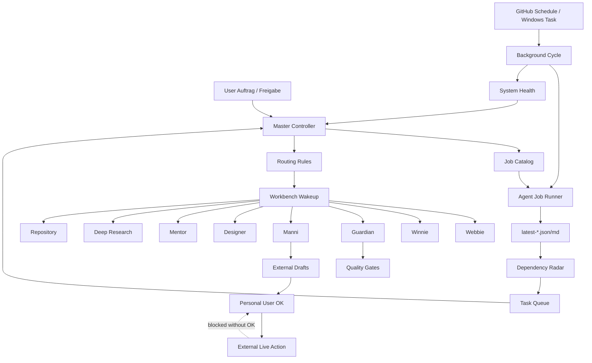

# AIRDOX Agenten-Systemstatus

Erstellt: 2026-06-24T16:41:25.040Z

## Ueberblick

- Status: ACTION_REQUIRED
- Jobs: 47 (24 script, 23 manual)
- Externe Live-Jobs mit Gate: 5
- Veraltete Berichte: 1
- Hinweise: 2

## Architektur

```mermaid
flowchart TD
  User[User Auftrag / Freigabe] --> MC[Master Controller]
  MC --> Catalog[Job Catalog]
  MC --> Router[Routing Rules]
  Router --> Wakeup[Workbench Wakeup]
  Wakeup --> Webbie
  Wakeup --> Winnie
  Wakeup --> Guardian
  Wakeup --> Manni
  Wakeup --> Designer
  Wakeup --> Mentor
  Wakeup --> Research[Deep Research]
  Wakeup --> Repository
  Catalog --> Runner[Agent Job Runner]
  Runner --> Reports[latest-*.json/md]
  Reports --> Radar[Dependency Radar]
  Radar --> Queue[Task Queue]
  Queue --> MC
  Guardian --> Gates[Quality Gates]
  Manni --> Drafts[External Drafts]
  Drafts --> Approval[Personal User OK]
  Approval --> Live[External Live Action]
  Live -. blocked without OK .-> Approval
  Scheduler[GitHub Schedule / Windows Task] --> Background[Background Cycle]
  Background --> Runner
  Background --> Health[System Health]
  Health --> MC
```

## Automatisierung

- npm background script: present
- health script: present
- Windows task installer: present
- .github/workflows/agent-background-monitor.yml: present
- .github/workflows/agent-job-dispatch.yml: present

## Berichte

| Bericht | Status | Alter h | Pfad |
| --- | --- | ---: | --- |
| background-cycle | aging | 26.93 | docs/agent-system/latest-background-cycle.json |
| job-run | fresh | 0.04 | docs/agent-system/latest-job-run.json |
| audit | fresh | 0.03 | docs/agent-system/latest-audit.json |
| dependency-radar | fresh | 0 | docs/agent-system/latest-agent-dependency-radar.json |
| task-queue | stale | 755.82 | docs/agent-system/latest-agent-task-queue.json |

## Hinweise

- watch: background-cycle is aging (26.93h old). Naechster Schritt: Let the next scheduled background cycle refresh it.
- action: task-queue is stale (755.82h old). Naechster Schritt: Run npm run agents:background:deep and inspect failed steps.

