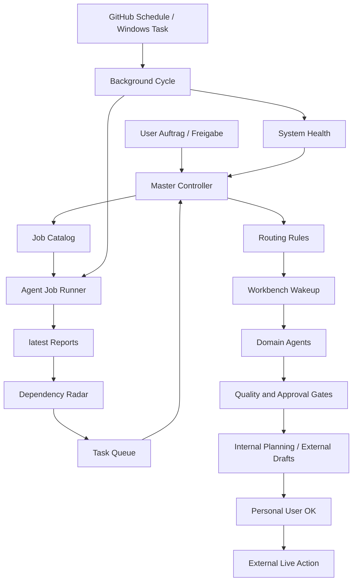

# AIRDOX Orchestration Workflow

Stand: 2026-05-02

## Ziel

Durchgaengiger Ablauf von Orchestrierung bis Job-Ausfuehrung mit klarer Gate-Logik und Run-Logs.

## Ablauf

1. Master Controller priorisiert Aufgaben und Trigger.
2. Job-Definition liegt zentral in `docs/agent-system/job-catalog.json`.
3. Vor Ausfuehrung validiert `npm run agent:jobs:validate`:
   - erlaubte Agentennamen
   - Trigger-Struktur
   - Execution-Mode
   - Script-Jobs gegen vorhandene `package.json`-Scripts
   - Approval-Pflicht fuer gravierende Jobs
4. Ausfuehrung mit `npm run agent:jobs:run -- --event=<event> --status=<status>`.
   Fuer alle Jobs mit `outputVisibility: external_live` zusaetzlich: `--user-approved=<job-id[,job-id...]>`.
5. Runner schreibt Ergebnisberichte:
   - `docs/agent-system/latest-job-run.json`
   - `docs/agent-system/latest-job-run.md`
6. Hintergrundautomation ruft den Ablauf periodisch auf:
   - `npm run agents:background:deep`
   - Workflow: `.github/workflows/agent-background-monitor.yml`
   - Lokal unter Windows: `npm run agents:background:task`

## Systemdiagramm

Die lebende Architektur wird maschinell erzeugt:

```powershell
npm run agent:system:health
```

Der Befehl schreibt:

- `docs/agent-system/AGENT_SYSTEM_ARCHITECTURE.md`
- `docs/agent-system/latest-agent-system-health.md`
- `docs/agent-system/latest-agent-system-health.json`



## Harte Automation

Der Background-Cycle ist nicht mehr nur ein Runner-Aufruf. Er fuehrt in jedem Lauf diese Kette aus:

1. `agent:jobs:validate`
2. `agent:route:write`
3. `agent:quality-chain:write`
4. `agent:jobs:run -- --event=scheduled_background --status=<standard|deep>`
5. `agent:dependencies:write`
6. `agent:system:health`

Wenn ein Schritt fehlschlaegt, bleibt der Fehler im `latest-background-cycle.json` sichtbar. Externe Live-Jobs bleiben trotz Automation blockiert, bis eine persoenliche Nutzerfreigabe uebergeben wurde.

Workbench-Wakeup:

- `agent-watch-zones.json` definiert stabile Beobachtungsbereiche mit Primary- und Review-Agenten.
- `agent-routing-review` schreibt, welche Agenten durch aktuelle Workbench-Aenderungen betroffen sind.
- `agent-quality-chain` schreibt, welche Test-, Proof- oder Validierungspflichten aus geaendertem Code entstehen.
- `notebooklm-deep-research-brief` schreibt verwertbare Research-Ergebnisse als `latest-notebooklm-brief.*` und Pflichtaufgaben als `latest-agent-task-queue.json`.
- `agent-dependency-radar` schreibt danach, wer auf wen wartet, welche Blocker bestehen und wann der Nutzer gezielt angesprochen werden muss.
- Nicht betroffene Agenten bleiben ohne Aktion. Betroffene Agenten duerfen interne Planungs- und Draft-Artefakte vorbereiten, aber keine Live-Aktion ohne Gate ausfuehren.
- Designer muss bei Social-Kampagnen proaktiv ein Portfolio vorbereiten (`designer-social-portfolio`), bevor ein finaler Render oder Upload-Entwurf erwartet wird.
- Research gilt erst als verarbeitet, wenn daraus konkrete Folgearbeit mit Owner und Acceptance-Kriterium entstanden ist.

Orchestrator Request Gate:

- Agenten duerfen interne Arbeit nicht eigenmaechtig breit starten.
- Jeder Agent stellt beim Master Controller einen Arbeitsantrag mit Ziel, Output, betroffenen Dateien und Gates.
- Master Controller ordnet an, verweigert oder reiht ein.
- Testweise interne Drafts und Prototypen duerfen nach Orchestrator-Anordnung automatisiert laufen.
- Extern/Live bleibt immer persoenlich freigabepflichtig.

Manni Social Execution:

- Reel-Queue-Generator: `npm run manni:reels:generate`
- schreibt:
  - `docs/agent-system/manni-reel-queue.json`
  - `docs/agent-system/manni-reel-weekly-plan.md`
- PR-/Social-Reach-Operations laufen als manuelle Jobs:
  - `pr-social-reach-ops-plan` plant konkrete Plattformaktionen fuer Instagram, Facebook und passende weitere Kanaele.
  - `pr-social-reach-ops-execute` fuehrt oder beauftragt nur persoenlich freigegebene Aktionen.

## Manueller Job-Dispatch (GitHub)

Workflow:

- `.github/workflows/agent-job-dispatch.yml`

Inputs:

- `event`
- `status`
- `approved` (kommagetrennte Freigaben fuer gravierende Job-IDs)
- `user_approved` (kommagetrennte persoenliche Nutzer-Freigaben fuer externe Live-Job-IDs)

Der Workflow validiert zuerst den Job-Katalog und fuehrt danach genau die Jobs fuer Event/Status aus.

## Approval-Regel

- Jobs mit `changeClass: gravierend` werden nur mit Master-Freigabe ausgefuehrt.
- Ohne Freigabe bleiben sie im Run-Log als `skipped`.
- Jobs mit `outputVisibility: external_draft` duerfen ohne Nutzer-OK erstellt werden, bleiben aber unveroeffentlicht.
- Jobs mit `outputVisibility: external_live` werden ohne persoenliches Nutzer-OK als `skipped` protokolliert.
- Manni-PR-Kampagnen laufen dreistufig: `pr-campaign-draft-pack` bereitet vor, `pr-campaign-user-preview` zeigt die Kampagne, `pr-campaign-live-publish` bringt sie erst mit `--user-approved=pr-campaign-live-publish` online.
- Manni-PR-Reach-Operations laufen zweistufig: `pr-social-reach-ops-plan` erstellt den ausfuehrbaren Plattformauftrag; `pr-social-reach-ops-execute` bleibt bis `--user-approved=pr-social-reach-ops-execute` blockiert und protokolliert danach Link/Kampagnen-ID, Budget, Plattform, Zeitpunkt und KPI-Recheck.

## Migration latest-*

Bestehende `docs/agent-system/latest-*`-Artefakte bleiben Run-Ausgaben und duerfen von Jobs ueberschrieben werden. Neue Governance-Regeln sollten zuerst im Job-Katalog und in den Validatoren landen; danach erzeugen die Runner die aktuellen `latest-*`-Dateien neu.

## CI-Regel

Pflichtchecks in `.github/workflows/web-quality.yml`:

- `npm run agent:audit -- --strict`
- `npm run agent:jobs:validate -- --strict-warnings`
- `npm run tasks:gate`
- `npm run master:gate`
- `npm run repository:monitor:strict`

Damit werden unvollstaendige Aufgaben, fehlende Freigaben und fehlerhafte Job-Spezifikationen vor Merge blockiert.
