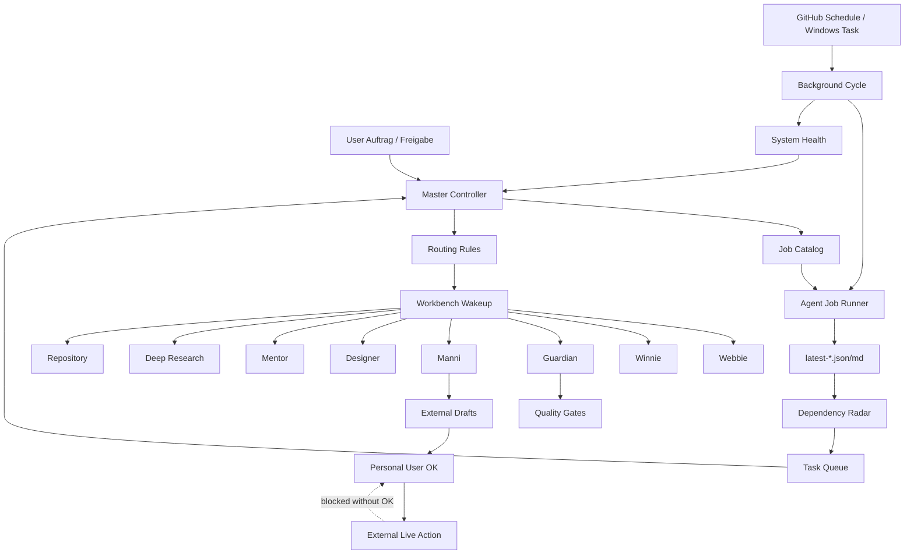

# AIRDOX Agent System Health

Generated: 2026-06-06T09:22:56.116Z

## Summary

- Status: OK
- Jobs: 45 (23 script, 22 manual)
- External live jobs gated: 5
- Stale reports: 0
- Alerts: 1

## Architecture

## Automation

- npm background script: present
- health script: present
- Windows task installer: present
- .github/workflows/agent-background-monitor.yml: present
- .github/workflows/agent-job-dispatch.yml: present

## Reports

| Report | Status | Age h | Path |
| --- | --- | ---: | --- |
| background-cycle | fresh | 1.62 | docs/agent-system/latest-background-cycle.json |
| job-run | fresh | 1.62 | docs/agent-system/latest-job-run.json |
| audit | fresh | 0.18 | docs/agent-system/latest-audit.json |
| dependency-radar | fresh | 1.6 | docs/agent-system/latest-agent-dependency-radar.json |
| task-queue | aging | 316.51 | docs/agent-system/latest-agent-task-queue.json |

## Alerts

- watch: task-queue is aging (316.51h old). Next: Let the next scheduled background cycle refresh it.

